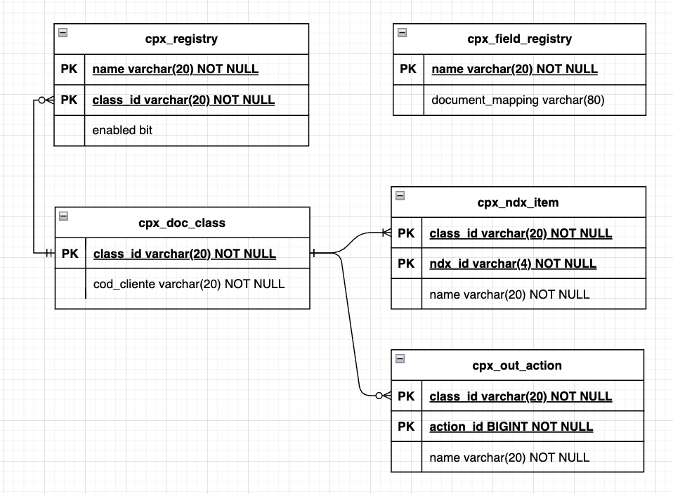

# Cpx DocClass - V1
QUesto documento ha l'obiettivo di descrivere la struttura delle definizioni a supporto della creazione dei pacchetti CPX
per l'invio in conservazione documentale. Le classi documentale sono definite oggi, all'interno dei micro-servizi che le usano, per il tramite
di file di configurazione yml. A questa configurazione mediante file *yaml* viene resa disponibile anche una configurazione su una persistenza relazionale (PostgreSQL)
che si aggiunge alla modalità via file yml. Di seguito due argomenti principali: 

- [descrizione della struttura delle classi](#struttura-di-una-classe-documentale) (oggi rappresentata come detto da file *.yml*)
- [modello relazionale postgreSQL](#persistenza-relazionale-su-postgresql) dello store a supporto.
   - [tabella cpx_doc_class](#cpxdocclass)
   - [tabella cpx_ndx_item](#cpxndxitem)
   - [tabella cpx_out_action](#cpxoutaction)
   - [tabella cpx_registry](#cpxregistry)
   - [tabella cpx_field_dictionary](#cpxfielddictionary)
   - [script sql](#script-sql)

## Struttura di una classe documentale

Nel file [README-files/pt_contratti.yml](README-files/pt_contratti.yml) e' riportato un esempio delle caratteristiche della configurazione di una classe.
Questa configurazione prevede tre parti principali:

- una serie di metadati (es. `platform`, `max-docs`, ...)
- una lista di definizioni che permettono di costruire l'elementi i-simo nell'XML di indice (elementi `Index_declaration` e `Letter_section > Index_value`)
- una lista di azioni che debbono essere fatte una volta che i documenti vengano esportati e che nella sostanza attuale si traducono in una valorizzazione di alcuni metadati dei documenti
oggetto di conservazione (se. `on-exported`).

A questi elementi di configurazione se ne aggiungono altri esterni al file .yml di configurazione vera e propria.

- il query cosmosdb (la parte di filtro) che serve per identificare i documenti da inviare in conservazione (es. `stato_sostitutiva in ('0','2') and flag_conserv = true and r_full_content_size>0.0 and numero_pagine>0 `) e che al momento è presente in un file `.md`
- un dizionario che indica la corrispondenza tra i nomi dei campi referenziati all'interno della definizione della classe documentale e il nome (completo di path) nel json dei documenti ritornati.

L'insieme delle classi documentali è poi raggruppato in una lista usata dal microservizio di ingestion per stabilire quali classi documentali debbano essere lavorate. Questa configurazione e' presente all'interno della configurazione del
micro-servizio e esterna alla configurazione della singola doc-class.

## Persistenza relazionale su PostgreSQL
Il passaggio da una configurazione *embedded* ad una configurazione su store esterno presenta il vantaggio di poter variare le configurazioni senza dover effettuare un nuovo deploy del/dei micro-servizi interessati.
In sostanza la corrispondenza declina la definizione della classe documentale in maniera SQL nativa suddividendo la definizione corrente in un insieme tabelle separate.

- cpx_doc_class: contiene i metadati di tipo primitivo che sono collegati alla classe documentale 
- cpx_ndx_item: in relazione con la tabella cpx_doc_class per chiave primaria definisce le entry che permettono la costruzione dell'indice  
- cpx_out_action: altra tabella di relazione che definisce le *entries* presenti nell' array yaml `on-exported`
- cpx_field_dictionary: tabella che definisce un dizionario di risoluzione tra nomi di campi referenziati nella definizione degli indici e il nome json completo del campo nei documenti ritornati
- cpx_registry: rappresenta la lista delle classi documentali che debbono essere lavorate.

Il disegno successivo mostra la relazione tra le entità. Non rappresenta tutti gli attributi ne' le dimensioni che debbono ritenersi esemplificative. Per questi dettagli si veda lo script
riportato di seguito e la descrizione delle entità.

### Tabelle componenti del modello

Di seguito riportiamo la descrizione delle tre entità

#### cpx_doc_class

| campo       | tipo          | nullable | note                                                                                                   | 
|-------------|---------------|----------|--------------------------------------------------------------------------------------------------------|
| class_id    | varchar(15)   | NOT NULL | identificativo della classe                                                                            |
| name        | varchar(40)   | NOT NULL | nome                                                                                                   |
| childIds    | varchar(80)   | NULL     | non utilizzato                                                                                         |
| extension   | varchar(3)    | NOT NULL | estensione del file in uscita (`cpx`)                                                                  |
| cod_cliente | varchar(10)   | NOT NULL | codice zeta del cliente                                                                                |
| max_cpx     | int           | NOT NULL |                                                                                                        |
| max_docs    | int           | NOT NULL | numero massimo di documenti in un file                                                                 |
| max_size    | int           | NOT NULL | dimensione massima del file                                                                            |
| platform    | varchar(10)   | NOT NULL | codice piattaforma per generazione nomi in output                                                      |
| servizio    | varchar(10)   | NOT NULL | informazione da indicare all'interno dei file in uscita                                                |
| procedura   | varchar(10)   | NOT NULL | informazione da indicare all'interno dei file in uscita                                                |
| version     | varchar(10)   | NOT NULL | informazione da indicare all'interno dei file in uscita                                                |
| pkg_layout  | varchar(2)    | NULL     | indica il formato specifico dei file (.xml e .inf contenuti). Vale v1 in tutti i casi e v3 in caso GED |
| sql_query   | varchar(1024) | NOT NULL | query di interrogazione su cosmos-db (colo la parte where)                                             |

#### cpx_ndx_item

| campo         | tipo        | nullable | note                                                                                                                                 | 
|---------------|-------------|----------|--------------------------------------------------------------------------------------------------------------------------------------|
| class_id      | varchar(15) | NOT NULL | identificativo della classe                                                                                                          |
| ndx_id        | int         | NOT NULL | progressivo a partire da 1 che viene usato come chiave insieme alla classe documentale e come id nella dichiarazione del file indice |
| name          | varchar(40) | NOT NULL | nome                                                                                                                                 |
| type          | varchar(10) | NULL     | costante che vale `User' se non specificato                                                                                          |
| data_type     | varchar(10) | NULL     | puo' valere `string`, `date` e principalmente viene valorizzato per la gestione del formato delle date insieme al campo `format`     |
| format        | varchar(10) | NULL     |                                                                                                                                      |
| value         | varchar(40) | NOT NULL | una stringa che rappresenta una espressione per calcolare, a partire dal documento in ingresso, il valore da attribuire all'elemento |
| source_format | varchar(10) | NULL     | utilizzato per le date per il parsing e la trasformazione di formato                                                                 |
| required      | bit         | NULL     | booleano che indica la obbligatorietà del valore calcolato dal campo `value`                                                         |

#### cpx_out_action

| campo      | tipo        | nullable | note                                                                                                                                                     | 
|------------|-------------|----------|----------------------------------------------------------------------------------------------------------------------------------------------------------|
| class_id   | varchar(15) | NOT NULL | identificativo della classe                                                                                                                              |
| action_id  | int         | NOT NULL | identificativo dell'azione per completare la primary key                                                                                                 |
| name       | varchar(40) | NOT NULL | nome del campo che insieme al campo field_name e alla tabella di lookup field_dictionary indica il campo da aggiornare nel documento una volta esportato |
| format     | varchar(10) | NULL     | utilizzo analogo al caso dell'indice.                                                                                                                    |
| value      | varchar(40) | NOT NULL | una stringa che rappresenta una espressione per calcolare, a partire dal documento in ingresso, il valore da attribuire all'elemento                     |
| field_name | varchar(40) | NULL     | viene utilizzato per stabilire il campo da aggiornare nel documento in uscita.                                                                           |

#### cpx_field_dictionary

| campo            | tipo        | nullable | note                                                                              | 
|------------------|-------------|----------|-----------------------------------------------------------------------------------|
| name             | varchar(40) | NOT NULL | nome del campo come referenziato nelle tabelle cpx_ndx_item e cpx_out_action      |
| document_mapping | varchar(80) | NOT NULL | corrispondenza con il nome json nel documento che viene inviato in conservazione. |

#### cpx_registry

| campo    | tipo        | nullable | note                                      | 
|----------|-------------|----------|-------------------------------------------|
| name     | varchar(40) | NOT NULL | nome della registry                       |
| class_id | varchar(15) | NOT NULL | identificativo della classe               |
| enabled  | bit         | NOT NULL | indica l'abilitazione o meno della stessa |

### Script SQL

Sono disponibili due script:

- il [ddl del modello dati](sql-scripts/postgresql-ddl.sql)
- (TBD) uno [script di popolamento delle tabelle](sql-scripts/postgresql-setup.sql) a partire dalle configurazioni disponibili al 2023-05-07.

